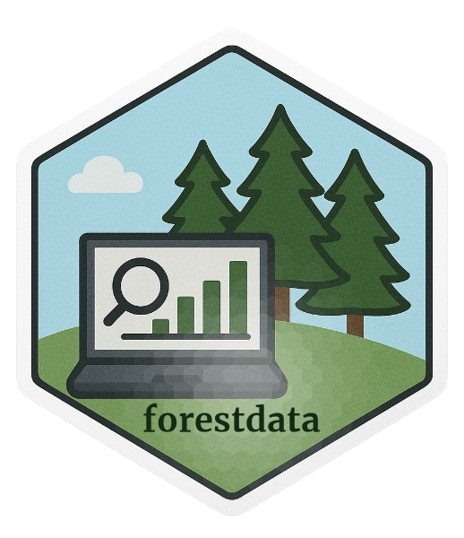

## forestdata 

`forestdata` is an R package for downloading forestry and land use data.
This package aims to provide users with easy access to various datasets
related to forestry and land use.

## Installation

You can install the development version of `forestdata` from GitHub
using the `pak` package:

``` r
pak::pak("Cidree/forestdata")
```

## Functions

In the following table, you can find a summary of the available
functions, a short description, and the object type of the output.

::: {align="center"}

:::

## Note

Please read the function documentation carefully. Some datasets may
require proper citation when used.
