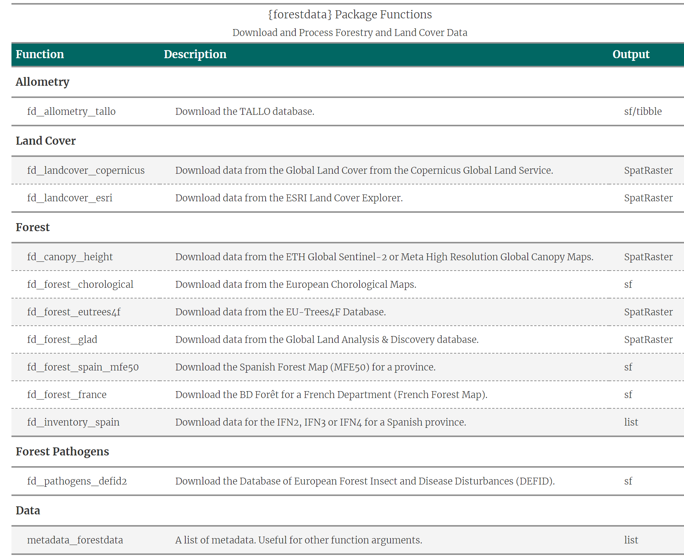

<!-- README.md is generated from README.Rmd. Please edit that file -->

# forestdata <a href="https://cidree.github.io/forestdata/"></a>

<!-- badges: start -->

[](https://CRAN.R-project.org/package=forestdata)
[](https://lifecycle.r-lib.org/articles/stages.html#experimental)
[](https://app.codecov.io/gh/Cidree/forestdata?branch=main)
[](https://www.gnu.org/licenses/gpl-3.0)
[](https://www.repostatus.org/#active)

<!-- badges: end -->

`forestdata` is an R package for downloading forestry and land use data.
This package aims to provide users with easy access to various datasets
related to forestry and land use.

## Installation

You can install the latest version in CRAN using:

``` r
pak::pak("forestdata")
```

Or you can install the development version using:

``` r
pak::pak("Cidree/forestdata")
```

## Functions

In the following table, you can find a summary of the available
functions, a short description, and the object type of the output.

<div align="center">



</div>

## Note

Please read the function documentation carefully. Some datasets may
require proper citation when used.
